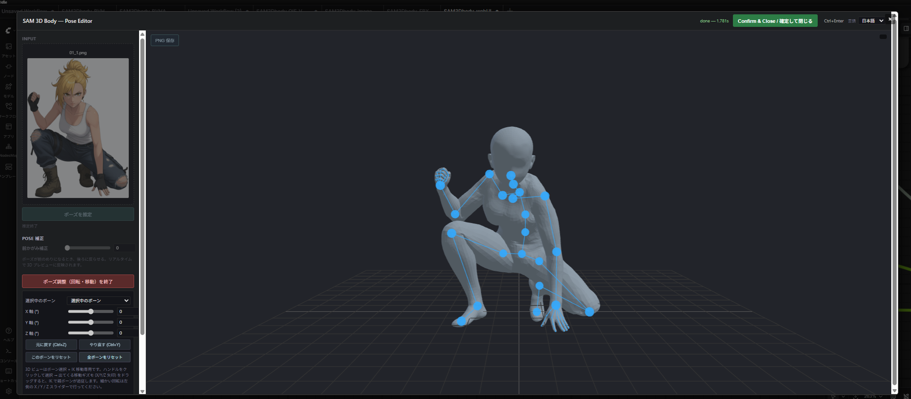
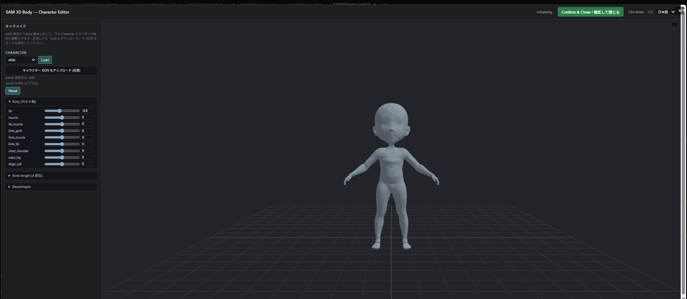

# ComfyUI-SAM3DBody_utills

**Language:** 🇯🇵 日本語 (current) ・ [🇬🇧 English](README.en.md)

[PozzettiAndrea/ComfyUI-SAM3DBody](https://github.com/PozzettiAndrea/ComfyUI-SAM3DBody) をベースにした、**「1 枚の画像からリグ付き 3D キャラクターを作る」** ことに焦点を絞った utility fork。

## ✏ へたくそな落書きを、ポーズリファレンスに変える


**左から順に**: ① 仕上げたいキャラクター ・ ② **手描きの雑なラフ** ・ ③ 本プラグインが出力する 3D 素体 (ラフから抽出したポーズをキャラクター体形に当てはめたもの) ・ ④ ③ を画像編集モデルに通した最終出力。

絵心がなくてもポーズさえ伝わればよく、**棒人間レベルの落書き → 正しいプロポーションと 3D 的整合性を持ったポーズ参照画像** に変換できるのが本プラグインの狙いです。得られた ③ を img2img / Qwen-Image-Edit などに食わせれば、④ のような仕上げ画像まで一気通貫で到達できます。

## このプラグインでできること

### 1. 入力画像のポーズを、任意の体形の 3D モデルでレンダリング

入力したキャラクター画像からポーズだけを抽出し、自分で設定した体形 (身長・太さ・顔の形・骨の長さ…) の 3D 素体に当てはめてレンダリングします。


### 2. リギング済みアニメーション FBX / BVH として書き出し

同じポーズ + 体形のキャラクターを、**アーマチュア + スキニング済みメッシュ + ポーズアニメ**を含む FBX として `<ComfyUI>/output/` に出力できます。FBXはそのまま Blender / Unity / Unreal Engine で読み込めます。BVHはCLIP STUDIO PAINTで読み込めるのを確認


### 3. 動画からモーションキャプチャ付き FBX / BVHを書き出し

`ComfyUI-VideoHelperSuite` で読み込んだ動画を各フレームごとに SAM 3D Body に通し、**基本姿勢でリグ付けされたキャラクターに連続モーションをベイク**したアニメーション FBX として `<ComfyUI>/output/` に書き出します。Unity にドロップすれば、そのまま Animator / Timeline で再生できるモーションクリップになります。BVHはCLIP STUDIO PAINTで読み込めるのを確認。

<!-- DEMO_VIDEO_START -->
https://github.com/user-attachments/assets/4fa43a56-8dd2-4ebf-8abe-61a31ff14e6f
<!-- DEMO_VIDEO_END -->

## 含まれるノード (10 個)

### モデル / 推論
1. **Load SAM 3D Body Model** — `<ComfyUI>/models/sam3dbody/` からモデル重みを遅延ロード
2. **SAM 3D Body: Process Image to Pose JSON** — SAM 3D Body で入力画像を解析し、ポーズを JSON として出力
   - `mask` 入力が未接続の場合は内蔵 BiRefNet Lite による自動マスクにフォールバック
   - 精度を上げたいときは明示的に `MASK` ノードを接続

### キャラ設定 / レンダリング
3. **SAM 3D Body: Setting Chara JSON** — preset と body / bone / blendshape スライダー一式を持ち、`chara_json` (STRING) を出力する設定ノード（旧 Render ノードのキャラ系部分が独立化）
4. **SAM 3D Body: Render Human From Pose And Chara JSON** — `pose_json` + `chara_json` を入力に取り、カメラ系設定 (`offset_x/y` / `scale_offset` / `camera_yaw/pitch_deg` / `width` / `height`) と前のめり補正 (`pose_adjust`) のみウィジェット化したレンダリングノード

### Web UI エディタ（ブラウザ内モーダル、JA/EN 切替）
5. **SAM 3D Body: Pose Editor** — 「Open Pose Editor」ボタンで起動。画像アップ → セグメンテーション + ポーズ推定 → 3D ボーン微調整 → 確定で `pose_json` (STRING) と `width` / `height` (INT) を出力
6. **SAM 3D Body: Character Editor** — 「Open Character Editor」ボタンで起動。スライダー + 3D プレビューで体形を作り込み、確定で `chara_json` (STRING) を出力

### FBX / BVH 書き出し（いずれも Blender 必須）
7. **SAM 3D Body: Export Rigged FBX** — アーマチュア + スキニング済みメッシュ + ポーズアニメ付きの FBX を `<ComfyUI>/output/` に書き出す
8. **SAM 3D Body: Export Animated FBX** — 動画 (IMAGE バッチ) から連続モーションをベイクしたアニメーション FBX を書き出す
9. **SAM 3D Body: Export Posed BVH** — 単一ポーズを humanoid 互換の BVH として `<ComfyUI>/output/` に書き出す
10. **SAM 3D Body: Export Animated BVH** — 動画 (IMAGE バッチ) または pose 配列から連続モーション BVH を書き出す

Meta の **SAM 3D Body** と **Momentum Human Rig (MHR)** がバンドルされており、それぞれのオリジナルライセンスに従います (詳細は [License](#license))。

## Installation

### 前提環境

- ComfyUI 本体がインストール済み (Python 3.11 推奨)
- Windows / Linux / macOS (動作確認は Windows 11 + Python 3.11)
- **Blender 4.1 以上** (一部機能で必要 — 下記参照)
- NVIDIA GPU (CUDA) を強く推奨 — 下記 VRAM 要件を参照

### GPU / VRAM 要件

SAM 3D Body の重み (約 3.4 GB) を常時 GPU に保持し、推論時のアクティベーションは 100 MB 未満で済む比較的軽量なモデルです。実測値（RTX A6000 / 1024×1024 入力 / 1 人物検出）:

| 項目 | 推論タイプ `full` | 推論タイプ `body` |
|---|---:|---:|
| モデル重み（常駐） | 3,374 MB | 3,374 MB |
| 推論中の追加アクティベーション | +93 MB | +69 MB |
| **総ピーク VRAM** | **約 3.5 GB** | 約 3.5 GB |
| 初回推論時間 | 3.06 s | 1.47 s |
| 2 回目以降（ウォーム後） | 1.13 s | 0.27 s |

**推奨スペック:**

| 用途 | 推奨 VRAM | 例 |
|---|---|---|
| **絶対最低**（このプラグイン単体で動かす） | **4 GB** | GTX 1650 など |
| **快適**（OS / 他プロセスと共存） | **6 GB** | RTX 3050 / 4060 など |
| **ComfyUI で他モデル（SDXL / Qwen-Image-Edit など）と併用** | **8 GB 以上** | RTX 3060 12GB / 4070 など（併用モデル次第） |

> モデルはモジュールレベルでキャッシュされる (`_MODEL_CACHE`) ため、ノードを 2 回目以降実行しても VRAM は増えません。CPU でも動作しますが大幅に遅くなるため CUDA を推奨します。

### Blender が必要な機能 ⚠

以下の 2 機能を使う場合は **[Blender](https://www.blender.org/) のインストールが必須** です。動作確認は Blender 4.1 (`C:/Program Files/Blender Foundation/Blender 4.1/blender.exe`)。

| 機能 | Blender 必須の理由 |
|---|---|
| **新規ブレンドシェイプの追加・編集** | `tools/bone_backup/all_parts_bs.fbx` のシェイプキーを GUI で直接編集 + `tools/extract_face_blendshapes.py` を Blender headless で呼び出して `presets/face_blendshapes.npz` を再生成 |
| **`SAM 3D Body: Export Rigged FBX` ノード** | ノード実行時に `blender.exe --background --python tools/build_rigged_fbx.py` を subprocess で呼び出し、armature / mesh / LBS 重み / ポーズアニメ を組み立てて FBX 書き出し |
| **`SAM 3D Body: Export Animated FBX` ノード** | ノード実行時に `blender.exe --background --python tools/build_animated_fbx.py` を subprocess で呼び出し、動画フレームごとの回転キーフレームをベイクしてアニメーション FBX を書き出す |
| **`SAM 3D Body: Export Posed BVH` ノード** | ノード実行時に `blender.exe --background --python tools/build_rigged_bvh.py` を subprocess で呼び出し、単一ポーズの BVH を書き出す |
| **`SAM 3D Body: Export Animated BVH` ノード** | ノード実行時に `blender.exe --background --python tools/build_animated_bvh.py` を subprocess で呼び出し、動画または pose 配列から BVH を書き出す |

Blender ダウンロード先:

- Win/x64: https://download.blender.org/release/Blender4.1/blender-4.1.1-windows-x64.zip
- Linux/x64: https://download.blender.org/release/Blender4.1/blender-4.1.1-linux-x64.tar.xz
- Linux/ARM: https://github.com/tori29umai0123/SAM3DBody_utills/releases/download/blender-arm64-v1.0/ARM_blender41-portable.tar.xz

### 通常インストール (推奨)

1. `C:\ComfyUI\custom_nodes\` (ComfyUI の `custom_nodes/` 直下) にこのリポジトリを配置
2. ComfyUI の Python 環境で以下を実行：

   ```
   cd C:/ComfyUI/custom_nodes/ComfyUI-SAM3DBody_utills
   C:/ComfyUI/.venv/Scripts/python.exe -m pip install -r requirements.txt
   C:/ComfyUI/.venv/Scripts/python.exe install.py
   ```

3. ComfyUI を起動 — 初回起動時に `jetjodh/sam-3d-body-dinov3` から SAM 3D Body のモデル重み (約 1.5 GB) が `<ComfyUI>/models/sam3dbody/` へ自動ダウンロードされます

### 手動インストール手順

自動ダウンロードが失敗する場合や、環境を細かく制御したい場合の手順です。

#### 1. ブートストラップ依存をインストール

```
C:/ComfyUI/.venv/Scripts/python.exe -m pip install -r requirements.txt
```

これで `comfy-env`, `comfy-3d-viewers`, `numpy`, `pillow`, `opencv-python-headless` などの軽量依存がメイン venv に入ります。

#### 2. 分離環境 (heavy dependencies) をセットアップ

```
C:/ComfyUI/.venv/Scripts/python.exe install.py
```

## License

本プロジェクトは **multi-license 構成** です。「どこが / どのライセンスか」を先に示すと次の 3 区分になります。ライセンス全文は `docs/licenses/` 配下。

| 区分 | 対象ファイル・アセット | ライセンス | 著作権者 |
|---|---|---|---|
| **自作コード**（ComfyUI ラッパー） | `nodes/`（`nodes/sam_3d_body/` を除く）, `tools/`, `web/`, `install.py`, `__init__.py`, `prestartup_script.py` など ComfyUI 統合コード全般 | **MIT License** <br>([LICENSE-MIT](docs/licenses/LICENSE-MIT)) | Copyright (c) 2025 Andrea Pozzetti（継承元） |
| **SAM 部分**（Meta SAM 3D Body 本体） | `nodes/sam_3d_body/` 配下のベンダードライブラリ（モデル・推論コード） | **SAM License** <br>([LICENSE-SAM](docs/licenses/LICENSE-SAM)) | Copyright (c) Meta Platforms, Inc. and affiliates |
| **MHR 関連**（Momentum Human Rig + 派生データ） | `mhr_model.pt` アセット、および MHR トポロジを前提に作った派生データ：`presets/face_blendshapes.npz`、`presets/` 配下の per-object 頂点 JSON、`tools/bone_backup/all_parts_bs.fbx` | **Apache License 2.0** <br>([LICENSE-MHR](docs/licenses/LICENSE-MHR) / [NOTICE-MHR](docs/licenses/NOTICE-MHR)) | Copyright (c) Meta Platforms, Inc. and affiliates |

> 注：**この fork 差分も MIT のまま追加しています**（wrapper 部分の著作権表記は継承元 Andrea Pozzetti のものが基準です）。また MHR は「アセットを同梱しているだけでなく、MHR のメッシュトポロジを前提にオーサリングした派生データも Apache 2.0 の派生物扱い」である点に注意してください。

リポジトリ全体の概要は [LICENSE](LICENSE)、第三者コード・アセットの帰属一覧は [THIRD_PARTY_NOTICES](docs/licenses/THIRD_PARTY_NOTICES) を参照してください。

### Using This Project

- ✅ wrapper 部分は MIT の条件のもと自由に利用・改変・再配布できます
- ✅ SAM 3D Body は SAM License のもとで研究・商用ともに利用可能です
- ✅ MHR（およびそのトポロジから派生させたブレンドシェイプ / 領域データ）は Apache 2.0 のもとで商用利用できます
- ⚠️ 再配布する場合は **LICENSE-MIT / LICENSE-SAM / LICENSE-MHR / NOTICE-MHR** を同梱してください
- ⚠️ SAM 3D Body を用いた成果を論文等で公表する際は SAM License に従い明示的に謝辞を入れてください

## Community

この fork に関する質問・機能要望は [tori29umai0123/ComfyUI-SAM3DBody_utills の Issues / Discussions](https://github.com/tori29umai0123/ComfyUI-SAM3DBody_utills) へ。

SAM 3D Body / MHR 本体や upstream の話題は [PozzettiAndrea/ComfyUI-SAM3DBody の Discussions](https://github.com/PozzettiAndrea/ComfyUI-SAM3DBody/discussions) および [Comfy3D Discord](https://discord.gg/bcdQCUjnHE) が参考になります。

## 同梱ワークフロー例

`workflows/` に 7 種類のサンプルワークフローを同梱しています。ComfyUI のメニューから `Workflow → Open` で読み込んでください。テスト入力として `workflows/input_image*.png` / `workflows/input_mask*.png` がそのまま使えます。

| ファイル | 内容 | Blender 必須 |
|---|---|---|
| **`SAM3Dbody_webUI.json`** | **Web UI エディタ版**。`SAM 3D Body: Pose Editor` と `SAM 3D Body: Character Editor` をブラウザ内モーダルで操作し、確定値を Render ノードに直結する最小構成 | ❌ |
| **`SAM3Dbody_image.json`** | シンプルな画像レンダリングワークフロー。入力した画像のポーズを、任意の体形でレンダリングする構成 | ❌ |
| **`SAM3Dbody_FBX.json`** | FBX 出力ワークフロー。入力した画像のポーズを任意の体形に適用し、アニメーション付き FBX として書き出す (Unity / Unreal Engine などで読み込み可能) | ✅ |
| **`SAM3Dbody_FBXAnimation.json`** | **動画モーションキャプチャ用ワークフロー**。`VHS_LoadVideo` で読み込んだ動画を `SAM 3D Body: Export Animated FBX` に流し込み、連続モーション付き FBX を出力する | ✅ |
| **`SAM3Dbody_ BVH.json`** | BVH 出力ワークフロー。入力画像のポーズを任意の体形に適用し、単一ポーズ BVH として書き出す。3D プレビューノードなし | ✅ |
| **`SAM3Dbody_BVHAnimation.json`** | **動画モーションキャプチャ用 BVH ワークフロー**。`VHS_LoadVideo` のフレーム列を `SAM 3D Body: Export Animated BVH` に流し込み、連続モーション BVH を出力する。3D プレビューノードなし | ✅ |
| **`SAM3Dbody _QIE_VNCCSpose.json`** | 実際の使用例ワークフロー。[Qwen-Image-Edit-2511](https://huggingface.co/Qwen/Qwen-Image-Edit) と VNCCSpose LoRA を組み合わせて、体形違いのキャラクター画像からポーズを抽出し、任意の体形の 3D 素体でレンダリングした結果を元に画像編集を行う | ❌ |

### `SAM3Dbody_webUI.json` の使い方 — ブラウザ内エディタでポーズ / キャラを確定

ComfyUI のキャンバス上のスライダーで延々と数値を打ち込む代わりに、**ブラウザ内のフルスクリーンモーダル**で 3D プレビューを見ながらポーズ推定とキャラ体形編集ができる、2 つの専用ノードを使う最小構成です。確定値は workflow JSON に保存されるので、ノードを閉じ直しても結果は失われません。日英 UI 切替対応。

#### `SAM 3D Body: Pose Editor` — ブラウザでポーズを確定



ノードに付いた **「Open Pose Editor」** ボタンを押すと、画像アップロード → セグメンテーション + ポーズ推定 → 3D ビュー上でのボーン微調整 (回転 / IK 移動 / 前かがみ補正) → **「Confirm & Close / 確定して閉じる」** までを 1 つのモーダル内で完結できます。確定すると `pose_json` (STRING) と画像サイズ `width` / `height` (INT) がノードから出力され、`SAM 3D Body: Render Human From Pose And Chara JSON` の入力に直接繋げます。

#### `SAM 3D Body: Character Editor` — ブラウザで体形を確定



同様に **「Open Character Editor」** ボタンで、MHR ニュートラル T-pose 素体に対して **PCA 9 軸の体形 / 4 部位のボーン長 / 顔・体ブレンドシェイプ** をスライダーで調整しながら、3D プレビューでリアルタイム反映できます。`presets/<active>/chara_settings_presets/*.json` のプリセット読み込みもこの画面から可能。確定すると `chara_json` (STRING) が出力され、Render ノードや `SAM 3D Body: Export Rigged FBX` などにそのまま流せます。

### `SAM3Dbody _QIE_VNCCSpose.json` の使い方


- **左 2 つ** が入力 (ポーズ参照となるキャラクター画像 + 差し替えたい体形のキャラクター画像)
- **真ん中** が経過ファイル (このプラグインがレンダした、目的の体形 + 入力ポーズの 3D 素体画像)
- **一番右** が最終出力 (真ん中の 3D 素体レンダを画像編集モデルに渡して仕上げた結果)

このプラグインの出力画像を、**Qwen-Image-Edit のような画像編集モデルに渡す中間出力物**として使う運用を想定したワークフローです。「ポーズは参照キャラから、体形は別キャラから」という 2 系統の入力を、ポーズ正確な 3D 素体を経由してマージできます。

## Render Human From Pose JSON ノード パラメータ説明

入力画像から推定されたポーズ（`pose_json`）を、**MHR ニュートラル体型**の人物モデルに当てはめてレンダリングするノード。

- 入力キャラクターの体型（`shape_params` / `scale_params`）は無視する
- ポーズ系（`global_rot` / `body_pose_params` / `hand_pose_params` / `expr_params`）のみ pose_json から採用
- 体型は UI の `body_*` / `bone_*` / `bs_*` スライダーで自由に変更可能（すべて既定値なら完全ニュートラル）

これにより、**異なる体型のキャラクター画像を読み込んでも同一体型で揃ったポーズ差分**を得られる。

### 基本入力（必須）

| パラメータ | 既定 | 範囲 | 説明 |
|---|---|---|---|
| model | — | — | SAM 3D Body モデル（Load ノードの出力） |
| pose_json | `"{}"` | — | ポーズ JSON（Process Image to Pose JSON ノードで生成） |
| preset | `"none"` | — | プリセット選択（現状は `none` 以外でも同じ挙動。プリセット機能は未実装） |
| offset_x | 0.0 | −5.0 〜 5.0 | 水平方向の位置オフセット（±両方向、メートル単位で `camera[0]` に加算）。**画像内で被写体を左右にずらす** |
| offset_y | 0.0 | −5.0 〜 5.0 | 垂直方向の位置オフセット（±両方向、`camera[1]` に加算）。**画像内で被写体を上下にずらす** |
| scale_offset | 1.0 | 0.1 〜 5.0 | カメラ距離の**乗算**オフセット。1.0 で等倍、0.1 で極端に近寄る、5.0 で遠ざかる |
| camera_yaw_deg | 0.0 | −180 〜 180 | **横軸オービット**。被写体重心を中心にカメラを水平回転。`+` でカメラが視聴者の右へ回り込み、被写体が左を向いたように見える。`±180` で真後ろ |
| camera_pitch_deg | 0.0 | −89 〜 89 | **縦軸オービット**。被写体重心を中心にカメラを垂直回転。`+` でカメラが上に上がり**見下ろし**、`−` で**見上げ**。被写体は画面中央に留まる |
| width | 0 | 0 〜 8192 | 出力幅（0 = pose_json の元画像サイズを使用） |
| height | 0 | 0 〜 8192 | 出力高（0 = pose_json の元画像サイズを使用） |

### 基本入力（任意）

| パラメータ | 説明 |
|---|---|
| background_image | 背景画像。未接続なら黒背景 |

### Body Params（PCA 体型）— `body_*`

**MHR モデルの 45 次元 PCA 体型空間の先頭 9 成分**を直接操作する 9 スライダー。

- 既定: **0.0（ニュートラル）**
- 範囲: **−5.0 〜 +5.0**（±両方向）
- 実用目安: ±1 で穏やかな変化、±3 で極端、±5 で崩壊気味
- **内部正規化済み**: PCA 基底が後ろの成分ほど小さくなるため、全 9 軸が同程度の変位量になるよう係数を内部で掛けている（`[1.00, 2.78, 4.42, 8.74, 10.82, 11.70, 13.39, 13.83, 16.62]`）。UI のスライダー値 ±1 であればどの軸も似たスケールで体型が変わる。

スライダー名は MHR の PCA 軸が学習した意味に基づく推定で、**実際に動く方向と名前が完全一致しない可能性あり**（効果は実際に動かして確認）。

| パラメータ | 担当 PCA 成分 | 想定される効果 |
|---|---:|---|
| body_fat              | `shape_params[0]` | 体脂肪量。正=太る、負=痩せる |
| body_muscle           | `shape_params[1]` | 筋肉量。正=筋肉質、負=華奢 |
| body_fat_muscle       | `shape_params[2]` | 脂肪と筋肉の比率 |
| body_limb_girth       | `shape_params[3]` | 四肢（腕・脚）の太さ |
| body_limb_muscle      | `shape_params[4]` | 四肢の筋肉量 |
| body_limb_fat         | `shape_params[5]` | 四肢の皮下脂肪量 |
| body_chest_shoulder   | `shape_params[6]` | 胸囲・肩幅。正=広い、負=狭い |
| body_waist_hip        | `shape_params[7]` | ウエスト・ヒップ。正=太い、負=細い |
| body_thigh_calf       | `shape_params[8]` | 太もも・ふくらはぎの太さ |

### ボーン長スケール — `bone_*`

MHR 骨格のリンク長を部位別にスケーリングする 4 スライダー。LBS を **per-joint 等方スケール** に拡張した定式化で、骨の長さ変更と同時にその joint 周辺のメッシュも等方的にスケールする。結果、プロポーションを保ったまま部位の長さだけが変わる（例: `bone_torso=0.6` で胴体は 0.6 倍に短くなるが、太さも同じく 0.6 倍になるので「チビ」になっても「ずんぐり」にはならない）。

- スケール 1.0 = 元のまま、0.5 で半分、2.0 で倍
- 分岐点（`clavicle_l/r`, `thigh_l/r`）自身のスケールは 1.0 固定 → 肩幅・股関節幅は維持される
- 定式化: `new_posed_vert = Σ_j w_j [ s_j · R_rel[j] · (rest_V - rest_joint[j]) + new_posed_joint[j] ]`

| パラメータ | 既定 | 範囲 | 適用される MHR ジョイント |
|---|---|---|---|
| bone_torso | 1.0 | 0.3 〜 1.8 | pelvis 自身 + pelvis → neck_01 のチェーン（股下から首の根元まで）。pelvis も対象に含めることで下腹部メッシュも一緒に縮む |
| bone_neck  | 1.0 | 0.3 〜 2.0 | `neck_01` → `head` リンク（首の長さ）。head の mesh_scale は 1.0 固定 — 頭のサイズは変わらず首だけ伸び縮みする |
| bone_arm   | 1.0 | 0.3 〜 2.0 | `clavicle_l/r` の子孫（`upperarm`, `lowerarm`, `hand`, 指） |
| bone_leg   | 1.0 | 0.3 〜 2.0 | `thigh_l/r` の子孫（`calf`, `foot`, つま先） |

実装は `_apply_bone_length_scales` (`nodes/processing/process.py`)。`joint_scale` と `mesh_scale` の 2 系統を分離しており、`_MESH_SCALE_STRENGTH=0.5` の緩衝で「骨の長さが 40% 縮んでもメッシュは 20% しか細くならない」ようバランスを取っている。

### ブレンドシェイプ — `bs_*`

FBX の `tools/bone_backup/all_parts_bs.fbx` から抽出したモーフターゲットを線形ブレンドで適用する 20 スライダー。各スライダーは **既定 0.0、範囲 0.0〜1.0**、1.0 でフル有効。複数同時に動かすと加算合成される。

シェイプの一覧は `presets/face_blendshapes.npz` から自動発見される — Blender で新しいシェイプキーを追加して npz を再生成すれば、再起動後に UI に現れる（コード変更不要）。UI 上の `bs_` プレフィックスは見やすさのためで、FBX 側のキー名・`settings_json` 側のキーではプレフィックスなし。

#### 顔

| パラメータ | 説明 |
|---|---|
| bs_face_big   | 顔全体を大きくする |
| bs_face_small | 顔全体を小さくする |
| bs_face_mangabig | 漫画的に顔を大きく盛る |
| bs_face_manga | 漫画的な顔立ち |
| bs_chin_sharp | 顎先をシャープにする |

#### 首

| パラメータ | 説明 |
|---|---|
| bs_neck_thick | 首を太くする |
| bs_neck_thin  | 首を細くする |

#### 胸

| パラメータ | 説明 |
|---|---|
| bs_breast_full | 胸を膨らませる |
| bs_breast_flat | 胸を平らにする |
| bs_chest_slim  | 胸郭をスリムにする |

#### 肩

| パラメータ | 説明 |
|---|---|
| bs_shoulder_wide   | 肩幅を広げる |
| bs_shoulder_narrow | 肩幅を狭める |
| bs_shoulder_slope  | なで肩／いかり肩を調整 |

#### 腰

| パラメータ | 説明 |
|---|---|
| bs_waist_slim | ウエストを細くする |

#### 手足

| パラメータ | 説明 |
|---|---|
| bs_limb_thick | 手足を太くする |
| bs_limb_thin  | 手足を細くする |
| bs_hand_big   | 手そのものを拡大 |
| bs_foot_big   | 足先を拡大 |

#### 筋肉

| パラメータ | 説明 |
|---|---|
| bs_MuscleScale | 全身の筋肉量を増やす（マッチョ化） |


### プリセットシステム

`chara_settings_presets/<name>.json` に上記形式の JSON を置くと、UI の `preset` プルダウンから選択できる。選択時は preset の値が UI スライダーを完全に上書きする（未記載のキーはニュートラル値扱い）。同梱の `female.json` / `male.json` が参考例。

## ⚠ Export Rigged FBX ノード（Blender 必須）

レンダリングと同じキャラ設定 + ポーズを、**アーマチュア + スキニング済みメッシュ + 30 フレームの静止ポーズアニメーション**付きのリギング済み FBX として `<ComfyUI>/output/` に書き出すノード。Blender / Unity / Unreal Engine でそのままインポートできます。

> **⚠ このノードの実行には Blender 4.1 以上のインストールが必須です。** ノード内部で `blender.exe --background --python tools/build_rigged_fbx.py` を subprocess として呼び出し、armature 構築・LBS スキニング・FBX エクスポートを行うためです。Blender を入れていない環境ではこのノードだけ実行時にエラーになります (他の 3 ノードは動きます)。

### 入力

| パラメータ | 説明 |
|---|---|
| model | Load SAM 3D Body Model の出力 |
| **character_json** | **キャラクター設定 JSON**。Render ノードの `settings_json` 出力を直結するか、`chara_settings_presets/*.json` の内容を貼り付ける (`body_params` / `bone_lengths` / `blendshapes` を含む)。UI テキストエリアの冒頭に `=== CHARACTER JSON ===` と表示されるのが目印 |
| **pose_json** | **ポーズ JSON**。`SAM 3D Body: Process Image to Pose JSON` ノードの `pose_json` 出力を直結 (`body_pose_params` / `hand_pose_params` / `global_rot` を含む)。UI テキストエリアの冒頭に `=== POSE JSON ===` と表示されるのが目印 |
| blender_exe | Blender の実行ファイルパス (既定 `C:/Program Files/Blender Foundation/Blender 4.1/blender.exe`)。subprocess で呼び出すため Blender 4.1 以上が必要 |
| output_filename | 出力 FBX 名 (既定 `sam3d_rigged.fbx`)。空にするとタイムスタンプ付きで自動命名 |

### 出力

| 出力 | 説明 |
|---|---|
| fbx_path | 書き出した FBX の絶対パス (`<ComfyUI>/output/<name>.fbx`) |


## ⚠ Export Animated FBX ノード（動画モーションキャプチャ / Blender 必須）

動画 (IMAGE バッチ) から **Unity / Unreal でそのまま再生できるモーション付き FBX** を 1 ノードで書き出すノードです。ComfyUI-VideoHelperSuite の `VHS_LoadVideo` 等で読み込んだフレーム列を渡すと、各フレームを SAM 3D Body に通してジョイント回転を推定し、**基本姿勢 (body_pose=0) でリグ付けされたキャラクターにすべてのフレームをキーフレームとしてベイク**します。出力 FBX はそのまま Animator / Animation / Timeline から再生可能です。

出力イメージは README 冒頭の [デモ動画](#3-動画からモーションキャプチャ付き-fbx-を書き出し) (`docs/sample1.mp4`) を参照してください。

## ⚠ Export Posed BVH ノード（Blender 必須）

単一ポーズを `<ComfyUI>/output/` 配下に **BVH** として書き出すノードです。`Render` ノードで作った体形設定と `Process Image to Pose JSON` のポーズをそのまま使えます。出力はメッシュなしの skeleton / motion のみで、humanoid 互換になるよう BVH 用に骨を整理してから書き出します。

> **⚠ 実行には Blender 4.1 以上が必須です。** 内部で `blender.exe --background --python tools/build_rigged_bvh.py` を subprocess として呼び出します。

## 開発者ガイド (Blender でブレンドシェイプを編集したい人向け)

> **ここから先は、Blender で `tools/bone_backup/all_parts_bs.fbx` を編集して新しいブレンドシェイプを追加・変更したい上級ユーザー向けの内容です。** 同梱済みの 18 ブレンドシェイプをそのまま使うだけなら読み飛ばしてかまいません。

新ブレンドシェイプの追加手順、`extract_face_blendshapes.py` / `rebuild_vertex_jsons.py` 等の実行コマンド、`tools/` 配下のスクリプト一覧は別ドキュメントに分割しました：

- 📖 **[docs/DEVELOPER_GUIDE.md](docs/DEVELOPER_GUIDE.md)** — 開発者ガイド (日本語)
- 📖 **[docs/DEVELOPER_GUIDE.en.md](docs/DEVELOPER_GUIDE.en.md)** — Developer guide (English)

## Credits

[SAM 3D Body](https://github.com/facebookresearch/sam-3d-body) by Meta AI ([paper](https://ai.meta.com/research/publications/sam-3d-body-robust-full-body-human-mesh-recovery/))