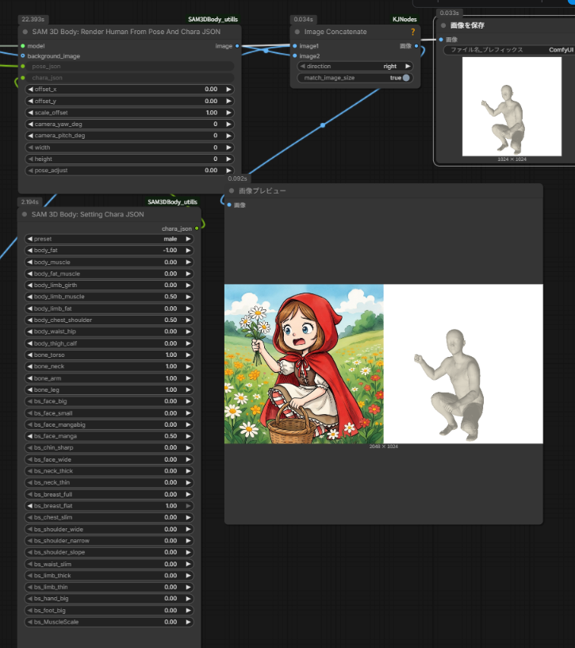
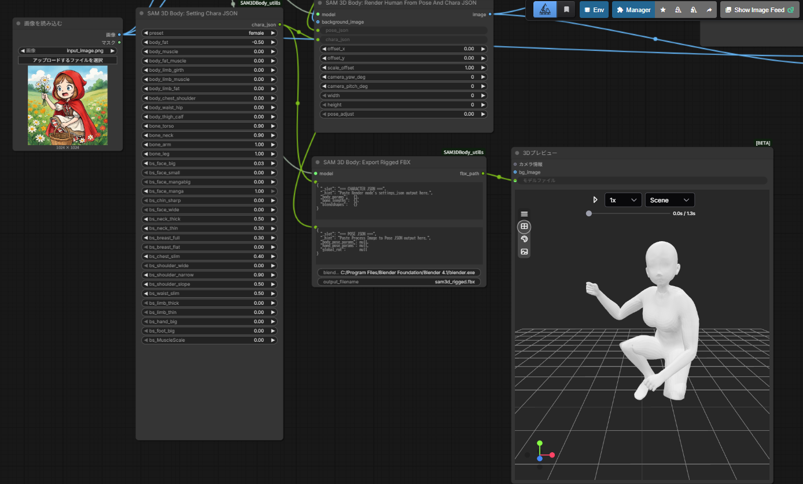
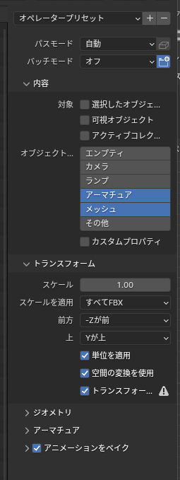
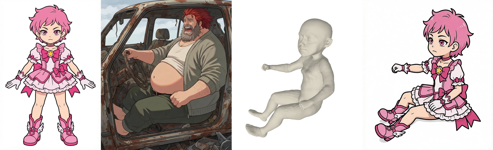

# ComfyUI-SAM3DBody_utills

**Language:** 🇯🇵 日本語 (current) ・ [🇬🇧 English](README.en.md)

[PozzettiAndrea/ComfyUI-SAM3DBody](https://github.com/PozzettiAndrea/ComfyUI-SAM3DBody) をベースにした、**「1 枚の画像からリグ付き 3D キャラクターを作る」** ことに焦点を絞った utility fork。

## ✏ へたくそな落書きを、ポーズリファレンスに変える


**左から順に**: ① 仕上げたいキャラクター ・ ② **手描きの雑なラフ** ・ ③ 本プラグインが出力する 3D 素体 (ラフから抽出したポーズをキャラクター体形に当てはめたもの) ・ ④ ③ を画像編集モデルに通した最終出力。

絵心がなくてもポーズさえ伝わればよく、**棒人間レベルの落書き → 正しいプロポーションと 3D 的整合性を持ったポーズ参照画像** に変換できるのが本プラグインの狙いです。得られた ③ を img2img / Qwen-Image-Edit などに食わせれば、④ のような仕上げ画像まで一気通貫で到達できます。

## このプラグインでできること

### 1. 入力画像のポーズを、任意の体形の 3D モデルでレンダリング

入力したキャラクター画像からポーズだけを抽出し、自分で設定した体形 (身長・太さ・顔の形・骨の長さ…) の 3D 素体に当てはめてレンダリングします。



### 2. リギング済みアニメーション FBX として書き出し

同じポーズ + 体形のキャラクターを、**アーマチュア + スキニング済みメッシュ + ポーズアニメ**を含む FBX として `<ComfyUI>/output/` に出力できます。そのまま Blender / Unity / Unreal Engine で読み込めます (※ この機能のみ Blender のインストールが必要)。



## 含まれるノード (4 つ)

1. **Load SAM 3D Body Model** — `<ComfyUI>/models/sam3dbody/` からモデル重みを遅延ロード
2. **SAM 3D Body: Process Image to Pose JSON** — SAM 3D Body で入力画像を解析し、ポーズを JSON として出力
3. **SAM 3D Body: Render Human From Pose JSON Debug** — 推定ポーズを MHR 素体にあてて、体形 / ボーン長 / ブレンドシェイプを全スライダー制御できる状態でレンダリング
4. **SAM 3D Body: Export Rigged FBX** — アーマチュア + スキニング済みメッシュ + ポーズアニメ付きの FBX を `<ComfyUI>/output/` に書き出す (Blender 必須)

Meta の **SAM 3D Body** と **Momentum Human Rig (MHR)** がバンドルされており、それぞれのオリジナルライセンスに従います (詳細は [License](#license))。

## Installation

### 前提環境

- ComfyUI 本体がインストール済み (Python 3.11 推奨)
- Windows / Linux / macOS (動作確認は Windows 11 + Python 3.11)
- **Blender 4.1 以上** (一部機能で必要 — 下記参照)

### Blender が必要な機能 ⚠

以下の 2 機能を使う場合は **[Blender](https://www.blender.org/) のインストールが必須** です。動作確認は Blender 4.1 (`C:/Program Files/Blender Foundation/Blender 4.1/blender.exe`)。

| 機能 | Blender 必須の理由 |
|---|---|
| **新規ブレンドシェイプの追加・編集** | `tools/bone_backup/all_parts_bs.fbx` のシェイプキーを GUI で直接編集 + `tools/extract_face_blendshapes.py` を Blender headless で呼び出して `presets/face_blendshapes.npz` を再生成 |
| **`SAM 3D Body: Export Rigged FBX` ノード** | ノード実行時に `blender.exe --background --python tools/build_rigged_fbx.py` を subprocess で呼び出し、armature / mesh / LBS 重み / ポーズアニメ を組み立てて FBX 書き出し |

**Blender が不要なケース:** 既存の 18 ブレンドシェイプと同梱プリセットを使って **ComfyUI 上でレンダリングするだけ** (`Load → ProcessToJson → Render` の 3 ノード構成) なら Blender はインストール不要です。

### 通常インストール (推奨)

1. `C:\ComfyUI\custom_nodes\` (ComfyUI の `custom_nodes/` 直下) にこのリポジトリを配置
2. ComfyUI の Python 環境で以下を実行：

   ```
   cd C:/ComfyUI/custom_nodes/ComfyUI-SAM3DBody_utills
   C:/ComfyUI/.venv/Scripts/python.exe -m pip install -r requirements.txt
   C:/ComfyUI/.venv/Scripts/python.exe install.py
   ```

3. ComfyUI を起動 — 初回起動時に `jetjodh/sam-3d-body-dinov3` から SAM 3D Body のモデル重み (約 1.5 GB) が `<ComfyUI>/models/sam3dbody/` へ自動ダウンロードされます

### 手動インストール手順

自動ダウンロードが失敗する場合や、環境を細かく制御したい場合の手順です。

#### 1. ブートストラップ依存をインストール

```
C:/ComfyUI/.venv/Scripts/python.exe -m pip install -r requirements.txt
```

これで `comfy-env`, `comfy-3d-viewers`, `numpy`, `pillow`, `opencv-python-headless` などの軽量依存がメイン venv に入ります。

#### 2. 分離環境 (heavy dependencies) をセットアップ

```
C:/ComfyUI/.venv/Scripts/python.exe install.py
```

`install.py` は `from comfy_env import install; install()` を呼び、`nodes/comfy-env.toml` の宣言に従って **SAM 3D Body 専用の pixi 分離環境** (`_env_*/` フォルダ) を構築します。ここに `torch`, `bpy`, `trimesh`, `transformers`, `huggingface-hub`, `xtcocotools`, `pytorch-lightning`, `pyrender`, `hydra-core` など約 30 個の heavy dependency がインストールされます。

> **macOS Note**: `xtcocotools` のビルドエラーが出る場合、`install.py` が自動で `--no-build-isolation` 付きの再試行を行います。手動対処する場合は `pip install --no-build-isolation xtcocotools`。

#### 3. SAM 3D Body モデル重みを配置

通常は初回起動時に HuggingFace から自動ダウンロードされますが、手動配置する場合：

1. [jetjodh/sam-3d-body-dinov3](https://huggingface.co/jetjodh/sam-3d-body-dinov3) から以下のファイルを取得
2. 以下のフォルダ構成で配置

   ```
   C:/ComfyUI/models/sam3dbody/
   ├── model.ckpt              (SAM 3D Body checkpoint, 約 1.3 GB)
   ├── model_config.yaml       (モデル設定)
   └── assets/
       └── mhr_model.pt        (Momentum Human Rig model, 約 200 MB)
   ```

保存先は `<ComfyUI>/models/sam3dbody/` で固定されています (UI で変更不可。`folder_paths.models_dir` を基準にしているので `extra_model_paths.yaml` の `models_dir` 差し替えには追従)。

#### 4. ComfyUI 起動時の動作確認

正常に組み込まれていれば、起動ログに以下が出ます:

```
[SAM3DBody] Registered server routes:
[SAM3DBody]   GET  /sam3d/autosave
[SAM3DBody]   GET  /sam3d/preset/{name}
```

ノードメニューには `SAM3DBody` カテゴリの下に 3 ノードが表示されます:

- `Load SAM 3D Body Model`
- `SAM 3D Body: Process Image to Pose JSON`
- `SAM 3D Body: Render Human From Pose JSON Debug`

### トラブルシューティング

| 症状 | 対処 |
|---|---|
| ノードメニューに SAM 3D Body が出ない | ComfyUI 起動時のコンソールに `[SAM3DBody]` のエラーが出ていないか確認。`pip install -r requirements.txt` と `python install.py` の両方を実行済みか確認 |
| モデルダウンロードが失敗する | 手動インストール手順の 3 でファイルを配置 |
| `comfy_env` が import できない | `pip install -r requirements.txt` が完了しているか確認 (`comfy-env==0.1.91` が入っている必要あり) |
| Blender 依存 (bpy) の import で止まる | `bpy` は `install.py` 実行時に分離環境へインストールされる。エラーが出る場合は `install.py` を再実行 |

### ⚠ ブレンドシェイプ編集には Blender が必須（※上級者向け）

> **この項は「自分でモデルをいじって新しいブレンドシェイプ・パラメータを増やしたい／既存シェイプを調整したい Blender ユーザー向け」の項目です。** 同梱済みの 18 ブレンドシェイプをそのまま使って ComfyUI でレンダリングするだけなら Blender は不要で、この節は読み飛ばしてかまいません。
>
> **Blender が必要になる理由:** FBX のシェイプキーを GUI で編集し、`tools/extract_face_blendshapes.py` を Blender headless で呼び出して `presets/face_blendshapes.npz` を再生成するため。

本ノードのブレンドシェイプは `tools/bone_backup/all_parts_bs.fbx` の**シェイプキー**として格納されています。自分で新しいシェイプキーを追加したり既存のものを編集したりする場合は、**追加・編集・値変更のすべてに [Blender](https://www.blender.org/) が必要**になります。

- **動作確認環境**: Blender 4.1（`C:/Program Files/Blender Foundation/Blender 4.1/blender.exe`）
- 他のバージョンでも動作する可能性はあるが、`tools/extract_face_blendshapes.py` 内のパスは 4.1 を前提に記載
- 別バージョンを使う場合は、コマンド例の `blender.exe` パスを置き換えてください

ブレンドシェイプ編集のワークフロー：

1. Blender で `tools/bone_backup/all_parts_bs.fbx` を開く
2. `mhr_reference` オブジェクトのシェイプキーを追加・編集
3. FBX として上書き保存（**エクスポート設定は下記に従う**）
4. 下記の [FBX 作成・更新後の実行コマンド](#fbx-作成更新後の実行コマンド) の 2 本を実行

繰り返しますが、既存の `presets/face_blendshapes.npz` をそのまま使ってレンダリングするだけなら Blender は触らなくて構いません。

#### FBX エクスポート設定（再出力時はこの設定で）



| 項目 | 値 |
|---|---|
| パスモード | 自動 |
| バッチモード | オフ |
| **対象（Limit to）** | **全て OFF**（選択したオブジェクト / 可視オブジェクト / アクティブコレクション はチェックしない） |
| **オブジェクトタイプ** | **アーマチュア** + **メッシュ** のみ選択（エンプティ / カメラ / ランプ / その他は選択しない） |
| カスタムプロパティ | OFF |
| **スケール** | **1.00** |
| **スケールを適用** | **すべて FBX** |
| **前方** | **-Z が前** |
| **上** | **Y が上** |
| 単位を適用 | ON |
| 空間の変換を使用 | ON |
| トランスフォームを適用 | ON |
| アニメーションをベイク | ON |

**重要**：**前方 = -Z / 上 = Y / スケール 1.0** は内部の座標変換行列（`_FBX_TO_MHR_ROT`）と整合するために必須です。他の軸設定で保存すると `extract_face_blendshapes.py` での位置マッチングが狂い、ブレンドシェイプが誤った方向に効きます。

## License

This project uses a **multi-license structure**. License files are located in `docs/licenses/`.

- **Wrapper Code** (ComfyUI integration): **MIT License** - See [LICENSE-MIT](docs/licenses/LICENSE-MIT)
  - This includes all nodes, UI components, installation scripts, and ComfyUI integration code
  - Copyright (c) 2025 Andrea Pozzetti

- **SAM 3D Body Library** (vendored in `sam_3d_body/`): **SAM License** - See [LICENSE-SAM](docs/licenses/LICENSE-SAM)
  - The core SAM 3D Body model and inference code
  - Copyright (c) Meta Platforms, Inc. and affiliates
  - Permissive license allowing commercial use and derivative works

- **Momentum Human Rig (MHR)** (`mhr_model.pt` asset + mesh topology used for blend-shape authoring): **Apache License 2.0** - See [LICENSE-MHR](docs/licenses/LICENSE-MHR) and [NOTICE-MHR](docs/licenses/NOTICE-MHR)
  - MHR parametric body model by Meta Platforms
  - Copyright (c) Meta Platforms, Inc. and affiliates
  - Custom blend-shape deltas (`presets/face_blendshapes.npz`) and per-object vertex JSONs derived from MHR topology inherit Apache-2.0

See [LICENSE](docs/licenses/LICENSE) for complete license information and [THIRD_PARTY_NOTICES](docs/licenses/THIRD_PARTY_NOTICES) for attributions.

### Using This Project

- ✅ You can freely use, modify, and distribute the wrapper code under MIT terms
- ✅ You can use SAM 3D Body for research and commercial purposes under SAM License terms
- ✅ You can use MHR (and any blend-shape / region data derived from it) commercially under Apache 2.0
- ⚠️ When redistributing, include **LICENSE-MIT**, **LICENSE-SAM**, **LICENSE-MHR** and **NOTICE-MHR**
- ⚠️ For outsourced blend-shape authoring against the MHR topology: contractor output is a derivative work under Apache 2.0; retain the MHR attribution in any deliverable that ships the mesh or its deltas
- ⚠️ Acknowledge SAM 3D Body in publications (required by SAM License)

## Community

この fork に関する質問・機能要望は [tori29umai0123/ComfyUI-SAM3DBody_utills の Issues / Discussions](https://github.com/tori29umai0123/ComfyUI-SAM3DBody_utills) へ。

SAM 3D Body / MHR 本体や upstream の話題は [PozzettiAndrea/ComfyUI-SAM3DBody の Discussions](https://github.com/PozzettiAndrea/ComfyUI-SAM3DBody/discussions) および [Comfy3D Discord](https://discord.gg/bcdQCUjnHE) が参考になります。

## Preset packs (ブレンドシェイプ定義の切替 / 配布)

このプラグインは、ブレンドシェイプ定義・頂点マップ・キャラクタープリセット JSON を **preset pack** という単位でまとめて管理します。ユーザーがオリジナルのブレンドシェイプ集を作って公開・配布できるようにするための仕組みです。

### ディレクトリ構造

```
ComfyUI-SAM3DBody_utills/
├── active_preset.ini                    ← どの pack を使うか指定
└── presets/
    └── default/                         ← 同梱のデフォルト pack
        ├── face_blendshapes.npz
        ├── mhr_reference_vertices.json
        └── chara_settings_presets/
            ├── autosave.json
            ├── chibi.json
            ├── female.json
            ├── male.json
            └── reset.json
```

`active_preset.ini` の中身:

```ini
[active]
pack = default
```

### pack の切替

他のユーザーが配布した pack (例: `my_custom_pack`) を使うには:

1. `presets/my_custom_pack/` として pack フォルダを配置 (上記構造と同じレイアウト)
2. `active_preset.ini` の `pack = default` を `pack = my_custom_pack` に書き換え
3. ComfyUI を再読み込み (F5)

指定した pack が見つからない場合は自動的に `default` へフォールバックします。

### 独自 pack の作り方

1. `presets/default/` を `presets/my_pack/` にコピー
2. `active_preset.ini` を `pack = my_pack` に変更
3. `tools/bone_backup/all_parts_bs.fbx` を Blender で開き、独自のブレンドシェイプを追加・編集
4. `tools/extract_face_blendshapes.py` を実行 — active pack (`my_pack`) の下に `face_blendshapes.npz` が更新され、`chara_settings_presets/*.json` と `process.py` の UI 順序も自動同期
5. 必要なら `tools/rebuild_vertex_jsons.py` で `mhr_reference_vertices.json` も再生成
6. `presets/my_pack/` フォルダ全体を zip して配布

pack 内のファイルはすべて自己完結しているので、受け取ったユーザーは `presets/` に drop して `active_preset.ini` を書き換えるだけで使えます。

## 同梱ワークフロー例

`workflows/` に 3 種類のサンプルワークフローを同梱しています。ComfyUI のメニューから `Workflow → Open` で読み込んでください。テスト入力として `workflows/input_image*.png` と `workflows/input_mask*.png` がそのまま使えます。

| ファイル | 内容 | Blender 必須 |
|---|---|---|
| **`SAM3Dbody_image.json`** | シンプルな画像レンダリングワークフロー。入力した画像のポーズを、任意の体形でレンダリングする構成 | ❌ |
| **`SAM3Dbody_FBX.json`** | FBX 出力ワークフロー。入力した画像のポーズを任意の体形に適用し、アニメーション付き FBX として書き出す (Unity / Unreal Engine などで読み込み可能) | ✅ |
| **`SAM3Dbody _QIE_VNCCSpose.json`** | 実際の使用例ワークフロー。[Qwen-Image-Edit-2511](https://huggingface.co/Qwen/Qwen-Image-Edit) と VNCCSpose LoRA を組み合わせて、体形違いのキャラクター画像からポーズを抽出し、任意の体形の 3D 素体でレンダリングした結果を元に画像編集を行う | ❌ |

### `SAM3Dbody _QIE_VNCCSpose.json` の使い方



- **左 2 つ** が入力 (ポーズ参照となるキャラクター画像 + 差し替えたい体形のキャラクター画像)
- **真ん中** が経過ファイル (このプラグインがレンダした、目的の体形 + 入力ポーズの 3D 素体画像)
- **一番右** が最終出力 (真ん中の 3D 素体レンダを画像編集モデルに渡して仕上げた結果)

このプラグインの出力画像を、**Qwen-Image-Edit のような画像編集モデルに渡す中間出力物**として使う運用を想定したワークフローです。「ポーズは参照キャラから、体形は別キャラから」という 2 系統の入力を、ポーズ正確な 3D 素体を経由してマージできます。

## Render Human From Pose JSON Debug ノード パラメータ説明

入力画像から推定されたポーズ（`pose_json`）を、**MHR ニュートラル体型**の人物モデルに当てはめてレンダリングするノード。

- 入力キャラクターの体型（`shape_params` / `scale_params`）は無視する
- ポーズ系（`global_rot` / `body_pose_params` / `hand_pose_params` / `expr_params`）のみ pose_json から採用
- 体型は UI の `body_*` / `bone_*` / `bs_*` スライダーで自由に変更可能（すべて既定値なら完全ニュートラル）

これにより、**異なる体型のキャラクター画像を読み込んでも同一体型で揃ったポーズ差分**を得られる。

### 基本入力（必須）

| パラメータ | 既定 | 範囲 | 説明 |
|---|---|---|---|
| model | — | — | SAM 3D Body モデル（Load ノードの出力） |
| pose_json | `"{}"` | — | ポーズ JSON（Process Image to Pose JSON ノードで生成） |
| preset | `"none"` | — | プリセット選択（現状は `none` 以外でも同じ挙動。プリセット機能は未実装） |
| offset_x | 0.0 | −5.0 〜 5.0 | 水平方向の位置オフセット（±両方向、メートル単位で `camera[0]` に加算） |
| offset_y | 0.0 | −5.0 〜 5.0 | 垂直方向の位置オフセット（±両方向、`camera[1]` に加算） |
| scale_offset | 1.0 | 0.1 〜 5.0 | カメラ距離の**乗算**オフセット。1.0 で等倍、0.1 で極端に近寄る、5.0 で遠ざかる |
| width | 0 | 0 〜 8192 | 出力幅（0 = pose_json の元画像サイズを使用） |
| height | 0 | 0 〜 8192 | 出力高（0 = pose_json の元画像サイズを使用） |

### 基本入力（任意）

| パラメータ | 説明 |
|---|---|
| background_image | 背景画像。未接続なら黒背景 |

### Body Params（PCA 体型）— `body_*`

**MHR モデルの 45 次元 PCA 体型空間の先頭 9 成分**を直接操作する 9 スライダー。

- 既定: **0.0（ニュートラル）**
- 範囲: **−5.0 〜 +5.0**（±両方向）
- 実用目安: ±1 で穏やかな変化、±3 で極端、±5 で崩壊気味
- **内部正規化済み**: PCA 基底が後ろの成分ほど小さくなるため、全 9 軸が同程度の変位量になるよう係数を内部で掛けている（`[1.00, 2.78, 4.42, 8.74, 10.82, 11.70, 13.39, 13.83, 16.62]`）。UI のスライダー値 ±1 であればどの軸も似たスケールで体型が変わる。

スライダー名は MHR の PCA 軸が学習した意味に基づく推定で、**実際に動く方向と名前が完全一致しない可能性あり**（効果は実際に動かして確認）。

| パラメータ | 担当 PCA 成分 | 想定される効果 |
|---|---:|---|
| body_fat              | `shape_params[0]` | 体脂肪量。正=太る、負=痩せる |
| body_muscle           | `shape_params[1]` | 筋肉量。正=筋肉質、負=華奢 |
| body_fat_muscle       | `shape_params[2]` | 脂肪と筋肉の比率 |
| body_limb_girth       | `shape_params[3]` | 四肢（腕・脚）の太さ |
| body_limb_muscle      | `shape_params[4]` | 四肢の筋肉量 |
| body_limb_fat         | `shape_params[5]` | 四肢の皮下脂肪量 |
| body_chest_shoulder   | `shape_params[6]` | 胸囲・肩幅。正=広い、負=狭い |
| body_waist_hip        | `shape_params[7]` | ウエスト・ヒップ。正=太い、負=細い |
| body_thigh_calf       | `shape_params[8]` | 太もも・ふくらはぎの太さ |

> 残り `shape_params[9..44]` は常に 0。`scale_params` も常に 0（MHR 骨格スケールはニュートラル）。

### ボーン長スケール — `bone_*`

MHR 骨格のリンク長を部位別にスケーリングする 4 スライダー。LBS を **per-joint 等方スケール** に拡張した定式化で、骨の長さ変更と同時にその joint 周辺のメッシュも等方的にスケールする。結果、プロポーションを保ったまま部位の長さだけが変わる（例: `bone_torso=0.6` で胴体は 0.6 倍に短くなるが、太さも同じく 0.6 倍になるので「チビ」になっても「ずんぐり」にはならない）。

- スケール 1.0 = 元のまま、0.5 で半分、2.0 で倍
- 分岐点（`clavicle_l/r`, `thigh_l/r`）自身のスケールは 1.0 固定 → 肩幅・股関節幅は維持される
- 定式化: `new_posed_vert = Σ_j w_j [ s_j · R_rel[j] · (rest_V - rest_joint[j]) + new_posed_joint[j] ]`

| パラメータ | 既定 | 範囲 | 適用される MHR ジョイント |
|---|---|---|---|
| bone_torso | 1.0 | 0.3 〜 1.8 | pelvis 自身 + pelvis → neck_01 のチェーン（股下から首の根元まで）。pelvis も対象に含めることで下腹部メッシュも一緒に縮む |
| bone_neck  | 1.0 | 0.3 〜 2.0 | `neck_01` → `head` リンク（首の長さ）。head の mesh_scale は 1.0 固定 — 頭のサイズは変わらず首だけ伸び縮みする |
| bone_arm   | 1.0 | 0.3 〜 2.0 | `clavicle_l/r` の子孫（`upperarm`, `lowerarm`, `hand`, 指） |
| bone_leg   | 1.0 | 0.3 〜 2.0 | `thigh_l/r` の子孫（`calf`, `foot`, つま先） |

実装は `_apply_bone_length_scales` (`nodes/processing/process.py`)。`joint_scale` と `mesh_scale` の 2 系統を分離しており、`_MESH_SCALE_STRENGTH=0.5` の緩衝で「骨の長さが 40% 縮んでもメッシュは 20% しか細くならない」ようバランスを取っている。

### ブレンドシェイプ — `bs_*`

FBX の `tools/bone_backup/all_parts_bs.fbx` から抽出したモーフターゲットを線形ブレンドで適用する 18 スライダー。各スライダーは **既定 0.0、範囲 0.0〜1.0**、1.0 でフル有効。複数同時に動かすと加算合成される。

シェイプの一覧は `presets/face_blendshapes.npz` から自動発見される — Blender で新しいシェイプキーを追加して npz を再生成すれば、再起動後に UI に現れる（コード変更不要）。UI 上の `bs_` プレフィックスは見やすさのためで、FBX 側のキー名・`settings_json` 側のキーではプレフィックスなし。

#### 顔

| パラメータ | 説明 |
|---|---|
| bs_face_big   | 顔全体を大きくする |
| bs_face_small | 顔全体を小さくする |
| bs_face_mangabig | 漫画的に顔を大きく盛る |
| bs_face_manga | 漫画的な顔立ち |
| bs_chin_sharp | 顎先をシャープにする |

#### 首

| パラメータ | 説明 |
|---|---|
| bs_neck_thick | 首を太くする |
| bs_neck_thin  | 首を細くする |

#### 胸

| パラメータ | 説明 |
|---|---|
| bs_breast_full | 胸を膨らませる |
| bs_breast_flat | 胸を平らにする |
| bs_chest_slim  | 胸郭をスリムにする |

#### 肩

| パラメータ | 説明 |
|---|---|
| bs_shoulder_wide   | 肩幅を広げる |
| bs_shoulder_narrow | 肩幅を狭める |
| bs_shoulder_slope  | なで肩／いかり肩を調整 |

#### 腰

| パラメータ | 説明 |
|---|---|
| bs_waist_slim | ウエストを細くする |

#### 手足

| パラメータ | 説明 |
|---|---|
| bs_limb_thick | 手足を太くする |
| bs_limb_thin  | 手足を細くする |
| bs_hand_big   | 手そのものを拡大 |
| bs_foot_big   | 足先を拡大 |

**仕様**:

- ブレンドシェイプ deltas は `presets/face_blendshapes.npz` に格納（FBX の全オブジェクト・全シェイプキーを無差別走査して抽出、Blender の world 座標で読む）
- 実行時は `R_rel = R_posed @ inv(R_rest)` による各ジョイントの rest→posed 相対回転を、**MHR の LBS スキニング重み**で頂点単位に加重合成し、SVD 直交化してから delta を posed 空間に回して加算する（`_apply_face_blendshapes`）
- 同一シェイプ名が複数オブジェクトに存在する場合は各オブジェクトが自分の領域にのみ delta を加算（横断ブレンドシェイプが自然に合成）
- FBX 頂点順 → MHR 頂点順の対応は、MHR rest ポーズに対する最近傍位置マッチで初回のみ計算・キャッシュ

**ブレンドシェイプ / region JSON の再生成**:

```
# 1. FBX から全シェイプキー deltas と全オブジェクトの world 座標を抽出
"C:/Program Files/Blender Foundation/Blender 4.1/blender.exe" ^
    --background --python tools/extract_face_blendshapes.py

# 2. npz から MHR rest ポーズに対する per-object vertex JSON を再生成
.venv/Scripts/python.exe custom_nodes/ComfyUI-SAM3DBody_utills/tools/rebuild_vertex_jsons.py
```

Blender 上で `tools/bone_backup/all_parts_bs.fbx` のシェイプキーを追加・編集 → 保存 → 上の 2 コマンドを走らせれば npz と region JSON が同期され、ComfyUI 再読み込みで UI にも反映される。

### 出力

| 出力 | 説明 |
|---|---|
| image | レンダリング結果（RGB） |
| settings_json | 現在の全スライダー値を含むキャラクター保存用 JSON（`chara_settings_presets/*.json` にそのまま貼り付け可能） |

`settings_json` の形式：

```json
{
  "body_params": { "fat": 0.0, "muscle": 0.0, ..., "thigh_calf": 0.0 },
  "bone_lengths": { "torso": 1.0, "neck": 1.0, "arm": 1.0, "leg": 1.0 },
  "blendshapes": { "face_big": 0.0, ..., "waist_slim": 0.0 }
}
```

UI の `body_*` / `bone_*` / `bs_*` プレフィックスは `settings_json` 側では削除され、`body_params.fat` / `bone_lengths.torso` / `blendshapes.face_big` のようなグルーピング構造になる。

### プリセットシステム

`chara_settings_presets/<name>.json` に上記形式の JSON を置くと、UI の `preset` プルダウンから選択できる。選択時は preset の値が UI スライダーを完全に上書きする（未記載のキーはニュートラル値扱い）。同梱の `female.json` / `male.json` が参考例。

## ⚠ Export Rigged FBX ノード（Blender 必須）

レンダリングと同じキャラ設定 + ポーズを、**アーマチュア + スキニング済みメッシュ + 30 フレームの静止ポーズアニメーション**付きのリギング済み FBX として `<ComfyUI>/output/` に書き出すノード。Blender / Unity / Unreal Engine でそのままインポートできます。

> **⚠ このノードの実行には Blender 4.1 以上のインストールが必須です。** ノード内部で `blender.exe --background --python tools/build_rigged_fbx.py` を subprocess として呼び出し、armature 構築・LBS スキニング・FBX エクスポートを行うためです。Blender を入れていない環境ではこのノードだけ実行時にエラーになります (他の 3 ノードは動きます)。

### 入力

| パラメータ | 説明 |
|---|---|
| model | Load SAM 3D Body Model の出力 |
| **character_json** | **キャラクター設定 JSON**。Render ノードの `settings_json` 出力を直結するか、`chara_settings_presets/*.json` の内容を貼り付ける (`body_params` / `bone_lengths` / `blendshapes` を含む)。UI テキストエリアの冒頭に `=== CHARACTER JSON ===` と表示されるのが目印 |
| **pose_json** | **ポーズ JSON**。`SAM 3D Body: Process Image to Pose JSON` ノードの `pose_json` 出力を直結 (`body_pose_params` / `hand_pose_params` / `global_rot` を含む)。UI テキストエリアの冒頭に `=== POSE JSON ===` と表示されるのが目印 |
| blender_exe | Blender の実行ファイルパス (既定 `C:/Program Files/Blender Foundation/Blender 4.1/blender.exe`)。subprocess で呼び出すため Blender 4.1 以上が必要 |
| output_filename | 出力 FBX 名 (既定 `sam3d_rigged.fbx`)。空にするとタイムスタンプ付きで自動命名 |

### 出力

| 出力 | 説明 |
|---|---|
| fbx_path | 書き出した FBX の絶対パス (`<ComfyUI>/output/<name>.fbx`) |

### 仕組み

1. **Python 側 (ComfyUI main venv)**
   - `character_json` の `body_params` / `bone_lengths` / `blendshapes` を Render ノードと同じロジックで MHR に展開し、キャラクター rest メッシュを計算
   - `pose_json` の `body_pose_params` / `hand_pose_params` / `global_rot` で posed スケルトン (各ジョイントの world 回転 + 位置) を計算
   - MHR の 127 ジョイントのうち、LBS スキニング重みを持たず「後続ジョイント」の親でもない純粋な末端関節 (指先・顔の末端など約 15 個) を package から除外 → Blender 出力は約 112 ボーンに整理
   - parent 階層、rest / posed の姿勢、sparse LBS スキニングウェイト (`V=18439 × J`) を一時 JSON にダンプ
2. **Blender (subprocess)**
   - 一時 JSON を読み込み、`tools/build_rigged_fbx.py` が以下を構築
     - Armature (rest pose の world 位置 + **MHR の rest 回転を bone.matrix で直接設定** — Blender が bone roll を head/tail から自動算出するのと違い、MHR の bind 姿勢に厳密に一致する rest orientation になる)
     - Mesh (rest pose の頂点位置)
     - 各ボーンに vertex group を作成、LBS 重みを書き込み
     - Armature modifier をメッシュに付与
     - Pose mode で **local delta rotation** を数式から計算して `pose_bone.rotation_quaternion` に設定 (`location` / `scale` は 0/1 固定 — 骨のワールド位置は rest オフセット + 回転累積の順運動学で決まる)
     - Frame 1 と Frame 30 の両方にキーフレーム → 長さ 1 秒の静止ポーズクリップ (長さ 0 のクリップは Unity が空扱いするため)
     - FBX エクスポート (`axis_forward=-Z / axis_up=Y`, `add_leaf_bones=False`, `bake_anim=True`, `bake_anim_force_startend_keying=True`)

### 使用例ワークフロー

```
LoadImage ──► SAM 3D Body: Process Image to Pose JSON ──► [pose_json]
                                                           │
LoadSAM3DBodyModel ──┬────────────────────────────────────┼──► model
                     │                                     │
                     └──► SAM 3D Body: Render ... ─► settings_json ─► [character_json]
                                                                        │
                                                SAM 3D Body: Export Rigged FBX
                                                                        │
                                                             <ComfyUI>/output/*.fbx
```

Render ノードで見た目を調整してから、その `settings_json` を Export Rigged FBX の `character_json` に流せば、**見たままの姿勢・体型のリギング済み FBX** が取れます。

### 出力 FBX の構成

| 項目 | 内容 |
|---|---|
| Armature | 約 112 ボーン (MHR 127 joint から weightless leaf 15 個を除外)。MHR rest pose に配置。rest orientation は MHR の bind rotation を厳密に再現 |
| Mesh | MHR rest pose の頂点位置 (18439 verts)。character_json の body/blendshape/bone length が反映済み |
| Vertex Groups + Armature Modifier | MHR の LBS スキニングウェイトを そのまま vertex group に展開。Blender / Unity / UE で開くと即 LBS スキンが効く |
| Animation | 1 個の Action (`SAM3D_Armature|Scene`)、frame 1〜30 の全フレームに同じ静止ポーズ = 1 秒の静止アニメ。Unity Timeline でも正常に再生される |
| 座標系 | FBX ファイル自体は Y-up / -Z-forward (UE/Unity の標準)。Blender 内部は Z-up で構築し export 時に 1 段階変換 (bake_space_transform は使わず) |

### 注意点

- **Blender のインストールが必要** — subprocess で `blender.exe --background --python` を呼びます。既存の `extract_face_blendshapes.py` と同じ Blender 4.1 を想定
- 初回実行時に Blender 起動オーバーヘッドが 3〜10 秒ほど発生します
- pose_json が空 (`{"body_pose_params": null, ...}`) の場合は rest pose のまま出力されます (エラーにはならない)
- `_slot` / `_hint` など UI プレースホルダー用のキーは runtime で無視されます

## 開発者ガイド: 新しいブレンドシェイプの追加

UI のブレンドシェイプは `presets/face_blendshapes.npz` の `meta_shapes` から動的に生成されるため、**Python コードの変更なしで追加できる**。ワークフローは以下。

### 手順

1. **Blender で `tools/bone_backup/all_parts_bs.fbx` を開く**
2. 変形させたいオブジェクト（`head` / `neck` / `chest` / `torso` / `hips` / 左右 `upper_arm` / `forearm` / `hand` など）を選択
3. オブジェクトプロパティ → **Shape Keys** から新しいキーを追加
   - まず `Basis`（ある場合はスキップ）
   - `＋` ボタンで新キー作成 → 名前を付ける（例: `belly_fat`）
   - キーを編集モードに入れて変形。保存時に value=1.0 時の形状が記録される
4. **複数オブジェクト横断させる場合**：同じ名前のシェイプキーを関係する全オブジェクトに追加し、それぞれで自分の領域を変形する（例: `neck_thicken` は `head` + `neck` + `chest` にそれぞれ存在）
5. FBX をエクスポート上書き保存（`File` → `Export` → `FBX` 、もしくは同名で保存）
6. **npz 再生成**（Blender headless で FBX を読み込み直し、全シェイプキーを抽出）：

   ```
   "C:/Program Files/Blender Foundation/Blender 4.1/blender.exe" ^
       --background --python tools/extract_face_blendshapes.py
   ```
7. **region JSON 再同期**（FBX 頂点を MHR インデックス空間へ NN マッピング）：

   ```
   .venv/Scripts/python.exe custom_nodes/ComfyUI-SAM3DBody_utills/tools/rebuild_vertex_jsons.py
   ```
8. **ComfyUI を再起動**（もしくは該当ノードを再読み込み）。新しいシェイプ名がスライダーとして自動的に UI に現れる

### 命名規則

FBX のシェイプキー名は `settings_json` のキー名と 1:1 で対応する（UI 上だけ `bs_` プレフィックスが付く）。UI 表示順 (`_UI_BLENDSHAPE_ORDER` @ `process.py`) は頭 → 首 → 胸 → 肩 → 腰 → 手足。新しいシェイプ名もこの部位順に揃えて追加すると並びが崩れません。`_UI_BLENDSHAPE_ORDER` に入っていないシェイプはアルファベット順で末尾に追加されます。

delta の posed フレームへの回転は **MHR LBS スキニング重み** から頂点単位に計算されるので、シェイプ名の規則による anchor 関節の指定は不要です。

### 既存シェイプの値を編集した場合

Blender で既存のシェイプキーを編集 → FBX 上書き → 手順 6〜8 を実行するだけ。値は **完全に上書き**される（npz / JSON はソースから毎回再生成されるため差分管理不要）。

### 新シェイプを UI に「出したくない」場合

ソース FBX の shape key 名を一時的に `_hidden_foo` のように変えれば抽出には含まれるが UI にも並ぶ（現状は全シェイプを無差別に公開）。UI からのみ隠したい場合は `_discover_blendshape_names()` にフィルタを追加する。

### 既存の npz / JSON を全削除して再構築したい場合

```
del presets\face_blendshapes.npz
del presets\*_vertices.json
# 手順 6 と 7 を実行
```

実行後、`presets/` に npz + 17 オブジェクト分の `<obj>_vertices.json` が揃う。

### FBX のパーツ分けを変更した場合（同じ頂点数）

MHR の総頂点数（18439）が変わらない範囲でパーツ分割を変えた場合、追加作業は不要です：

- `tools/bone_backup/all_parts_bs.fbx` でオブジェクトを再分割（頂点移動やオブジェクトの rename / 追加 / 削除）→ 保存
- 手順 6〜8 を実行するだけで、
  - `rebuild_vertex_jsons.py` が NN マッチングで各 MHR 頂点を現在のパーツへ再割り当て
  - FBX に存在しないオブジェクト名の `presets/<obj>_vertices.json` は自動削除
  - npz も全オブジェクト分を再生成するので stale データが残らない

オブジェクト名（例: `head`, `torso` など）と `presets/<obj>_vertices.json` の名前は 1 対 1 対応で自動的に揃います。

### FBX の総頂点数そのものを変えた場合

MHR 頂点数（18439）と食い違うため、NN マッチングに失敗する頂点が出ます。この場合は MHR rest-pose 参照メッシュ（`tools/export_reference_obj.py` で生成した `mhr_reference.obj`）をベースに Blender でパーツ分割し直し、新しい `all_parts_bs.fbx` を作り直してから手順 6〜8 を実行してください。

## FBX 作成・更新後の実行コマンド

Blender で `tools/bone_backup/all_parts_bs.fbx` を編集・保存したあと、**ComfyUI ルート (`C:/ComfyUI`)** で以下の 2 本を順に実行するだけで全同期されます。

### 1. FBX からブレンドシェイプ + 全オブジェクト位置を抽出

```
"C:/Program Files/Blender Foundation/Blender 4.1/blender.exe" ^
    --background --python custom_nodes/ComfyUI-SAM3DBody_utills/tools/extract_face_blendshapes.py
```

→ `presets/face_blendshapes.npz` を生成・上書き

### 2. 各オブジェクトの頂点 JSON を再生成

```
.venv/Scripts/python.exe custom_nodes/ComfyUI-SAM3DBody_utills/tools/rebuild_vertex_jsons.py
```

→ `presets/<obj>_vertices.json` を全オブジェクト分生成（FBX に存在しないオブジェクト名の JSON は自動削除）

### 3. ComfyUI を再読み込み

ブラウザで ComfyUI を更新すれば、新しいシェイプキーのスライダーが UI に自動出現し、新しいパーツ構成での変形が有効化されます。

> **別ディレクトリから実行する場合**は、スクリプトパスを絶対パスに差し替えてください：
> ```
> .venv/Scripts/python.exe "C:/ComfyUI/custom_nodes/ComfyUI-SAM3DBody_utills/tools/rebuild_vertex_jsons.py"
> ```

## tools/ スクリプト一覧

Blender と Python venv を使い分けるスクリプトが揃っています。通常運用で触るのは **extract_face_blendshapes.py** と **rebuild_vertex_jsons.py** の 2 本だけです。

### 日常運用（FBX を編集したら毎回）

| スクリプト | 実行環境 | 役割 |
|---|---|---|
| `tools/extract_face_blendshapes.py` | **Blender** (`--background --python`) | `tools/bone_backup/all_parts_bs.fbx` を読み、全メッシュ・全シェイプキーを走査して `presets/face_blendshapes.npz` を生成。各オブジェクトの base 位置と shape delta を `base__<obj>` / `delta__<obj>__<shape>` キーで格納。全オブジェクトの world 座標も `all_base__<obj>` に保存（rebuild 用） |
| `tools/rebuild_vertex_jsons.py` | **ComfyUI venv** (`.venv/Scripts/python.exe`) | npz の `all_base__<obj>` と MHR rest-pose 頂点を NN マッチングし、`presets/<obj>_vertices.json` を全オブジェクト分再生成。FBX のパーツ分けが変わった場合は自動追従、stale JSON は自動削除 |

Blender で FBX を編集 → 保存 → この 2 本を走らせる → ComfyUI 再読み込み、の流れが基本フロー。

### セットアップ / 再構築時

| スクリプト | 実行環境 | 役割 |
|---|---|---|
| `tools/export_reference_obj.py` | ComfyUI venv | MHR rest-pose メッシュを**単一の非パーツ OBJ**として `tools/bone_backup/mhr_reference.obj` に出力。FBX が破損した場合のバックアップ / Blender でゼロからパーツ再分割したい時の出発点として使用 |

### 出力ファイルの役割早見表

| ファイル | 生成元 | 使われる場所 |
|---|---|---|
| `presets/face_blendshapes.npz` | `extract_face_blendshapes.py` | ランタイムのブレンドシェイプ適用 + UI スライダー名の自動発見 |
| `presets/<obj>_vertices.json` × 17 | `rebuild_vertex_jsons.py` | ランタイムでブレンドシェイプ delta を対応 MHR 頂点に加算する際の region 参照 |
| `tools/bone_backup/all_parts_bs.fbx` | ユーザーが Blender で編集 | FBX の権威。ここからシェイプキー / パーツ分けが全て決まる |
| `tools/bone_backup/mhr_reference.obj` | `export_reference_obj.py` | バックアップ用の MHR rest-pose 単一メッシュ（FBX 作り直しの出発点） |
| `chara_settings_presets/*.json` | ユーザーが手編集 | ランタイムの preset プルダウン |

## Credits

[SAM 3D Body](https://github.com/facebookresearch/sam-3d-body) by Meta AI ([paper](https://ai.meta.com/research/publications/sam-3d-body-robust-full-body-human-mesh-recovery/))

Blender installation code adapted from [ComfyUI-UniRig](https://github.com/VAST-AI-Research/UniRig) (MIT License)
